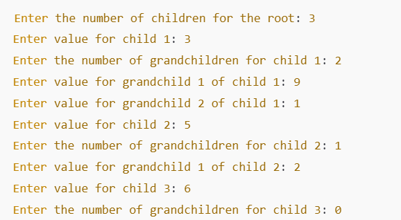
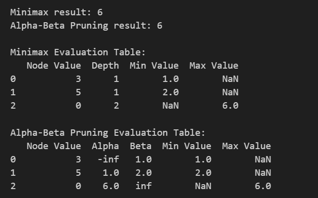
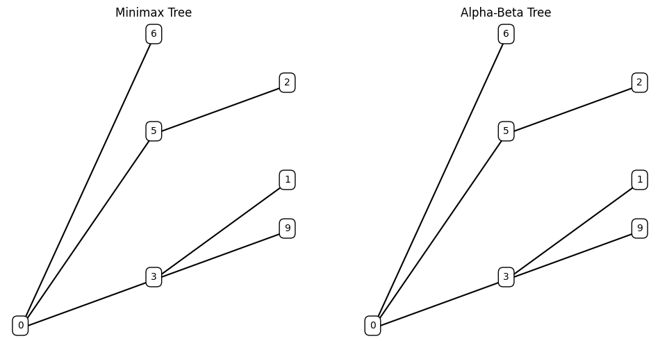

# CIA-1 
# Search Algorithms

This repository contains implementations of various search algorithms commonly used in computer science and artificial intelligence. Each algorithm has been implemented to demonstrate its unique approach to solving problems, particularly in the context of searching through data structures.

## Table of Contents

- [Introduction](#introduction)
- [Algorithms Overview](#algorithms-overview)
- [Implementation](#implementation)
- [Results](#results)
- [License](#license)

## Introduction

Searching algorithms are fundamental in computer science for retrieving data from a data structure. This project includes 12 different search algorithms, each suited for different scenarios and types of data.

## Algorithms Overview

### 1. Linear Search
- **Description**: A simple search algorithm that checks each element in a list until the desired element is found or the list ends.
- **Time Complexity**: O(n)

### 2. Binary Search
- **Description**: A search algorithm that finds the position of a target value within a sorted array by repeatedly dividing the search interval in half.
- **Time Complexity**: O(log n)

### 3. Depth-First Search (DFS)
- **Description**: An algorithm for traversing or searching tree or graph data structures, starting at the root and exploring as far as possible along each branch before backtracking.
- **Time Complexity**: O(V + E)

### 4. Breadth-First Search (BFS)
- **Description**: An algorithm for traversing or searching tree or graph data structures that explores all the neighbor nodes at the present depth prior to moving on to nodes at the next depth level.
- **Time Complexity**: O(V + E)

### 5. A* Search
- **Description**: A graph traversal and pathfinding algorithm that uses heuristics to improve search efficiency.
- **Time Complexity**: O(E) (where E is the number of edges)

### 6. Dijkstra's Algorithm
- **Description**: An algorithm for finding the shortest paths between nodes in a graph, which may represent, for example, road networks.
- **Time Complexity**: O(V^2) or O(E + V log V) with a priority queue.

### 7. Uniform Cost Search
- **Description**: A search algorithm that expands the least costly node first.
- **Time Complexity**: O(E + V)

### 8. Bidirectional Search
- **Description**: A search algorithm that finds the shortest path by simultaneously searching from both the initial state and the goal state.
- **Time Complexity**: O(b^(d/2))

### 9. Hill Climbing
- **Description**: A mathematical optimization algorithm that continuously moves towards the direction of increasing value (uphill) to find the peak.
- **Time Complexity**: O(n)

### 10. Simulated Annealing
- **Description**: A probabilistic technique for approximating the global optimum of a given function, inspired by the annealing process in metallurgy.
- **Time Complexity**: O(n)

### 11. Greedy Best-First Search
- **Description**: An algorithm that selects the path that appears to be the best at each step, based on a heuristic function.
- **Time Complexity**: O(b^m) where m is the maximum depth.

### 12. Beam Search
- **Description**: A search algorithm that explores a graph by expanding the most promising nodes in a limited set.
- **Time Complexity**: O(b^w) where w is the beam width.

## Implementation

The implementations are written in Python and include the following key components for each algorithm:

1. **Algorithm Function**: Each algorithm has its own function to execute the search logic.
2. **Data Structures**: Various data structures are used (arrays, graphs, etc.) to demonstrate the search capabilities.
3. **Visualization**: Some algorithms include visualizations using `matplotlib` to illustrate their search process.

## Results

Upon running the scripts for each algorithm, you will receive outputs showcasing:

- Search paths taken by each algorithm.
- Time taken to find the desired element or path.
- Visual representations of the search process, if applicable.

### Sample Input

The input format varies by algorithm and can include lists, graphs, or specific data structures.

### Sample Output

The output will vary based on the algorithm, demonstrating the effectiveness of each search method.

## License

This project is licensed under the MIT License. See the [LICENSE](LICENSE) file for more details.

---

# CIA - 2
# Minimax and Alpha-Beta Pruning Algorithms

This repository contains implementations of the **Minimax** and **Alpha-Beta Pruning** algorithms, which are widely used in artificial intelligence for decision-making in two-player games. The algorithms evaluate game states to determine the best possible move for a player, considering the opponent's best possible responses.

## Table of Contents

- [Introduction](#introduction)
- [Algorithms Overview](#algorithms-overview)
- [Implementation](#implementation)
- [Results](#results)
- [License](#license)

## Introduction

In two-player games, players alternate turns, and each player tries to maximize their own score while minimizing the opponent's score. The Minimax algorithm systematically explores all possible moves to find the optimal one. Alpha-Beta Pruning optimizes the Minimax algorithm by eliminating branches that do not need to be evaluated.

## Algorithms Overview

### Minimax Algorithm
The Minimax algorithm evaluates game positions to determine the best move for the maximizing player. The algorithm assumes that the opponent plays optimally, minimizing the player's potential score.

- **Time Complexity**: O(b^d), where b is the branching factor and d is the depth of the tree.
- **Space Complexity**: O(b * d).

### Alpha-Beta Pruning
Alpha-Beta Pruning is an optimization technique for the Minimax algorithm. It reduces the number of nodes evaluated in the game tree by pruning branches that won't affect the final decision.

- **Time Complexity**: O(b^(d/2)) in the best case.
- **Space Complexity**: O(b * d).

## Implementation

The implementation is written in Python and includes the following key components:

1. **Node Class**: Represents a node in the game tree.
2. **Minimax Function**: Implements the Minimax algorithm.
3. **Alpha-Beta Function**: Implements the Alpha-Beta Pruning algorithm.
4. **Evaluation Functions**: Used to evaluate the utility of terminal nodes.
5. **Tree Visualization**: Uses `matplotlib` to display the game tree.
6. **User Input**: Allows users to define the game tree dynamically.

## Results

Upon running the script, you will receive the following outputs:

- **Minimax Result**: The optimal move value determined by the Minimax algorithm.
- **Alpha-Beta Pruning Result**: The optimal move value determined by the Alpha-Beta Pruning algorithm.

The program will also generate evaluation tables for both algorithms, showcasing their decision-making processes.

### Sample Input

### Sample Output

Here’s an example of what the output might look like:

## License

This project is licensed under the MIT License. See the [LICENSE](LICENSE) file for more details.
